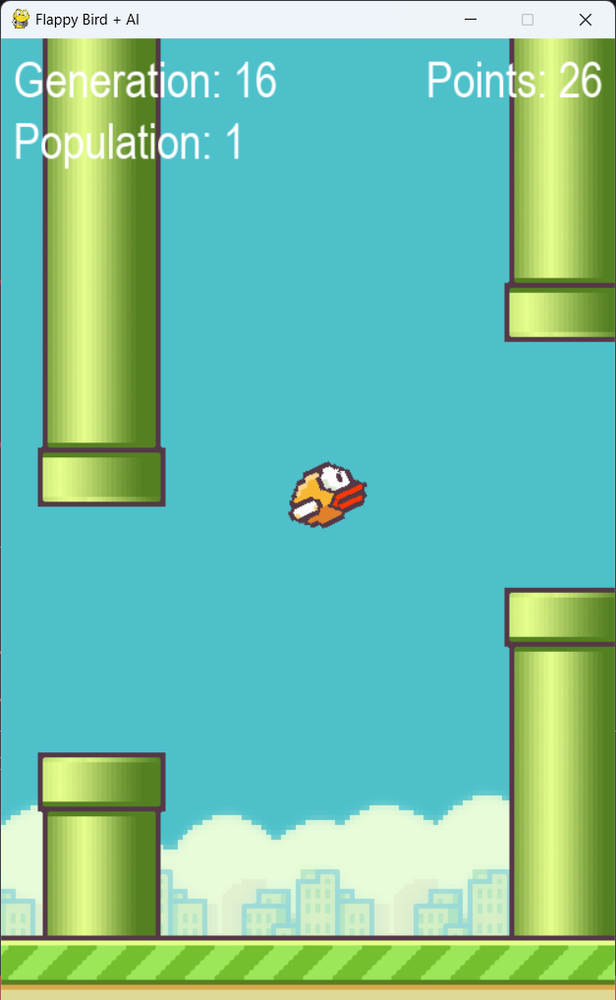

# Flappy Bird + AI



Este projeto é uma reimaginação do famoso Flappy Bird, porém com duas coisas diferentes:
  1. Os canos se movem para cima e para baixo, deixando o jogo um pouco mais desafiador.
  2. É possível ligar uma inteligência artificial para jogar.

## Descrição

O Flappy Bird + AI é um projeto que usa algoritmos de aprendizado de máquina para ensinar uma rede neural a jogar o Flappy Bird. Ele usa o Pygame para criar o jogo e a biblioteca neat para treinar a rede neural.

## Tecnologias utilizadas

- Python 3.11
- Game Engine pygame
- Rede neural neat

## Como usar

Para jogar o Flappy Bird + AI, basta seguir os seguintes passos:

1. Abra o arquivo FlappyBird.py, e logo no início altere a constante AI_PLAYING para False.

```python
AI_PLAYING = False
```

2. Abra o terminal e vá para a pasta onde você instalou o projeto.

3. Execute o seguinte comando:

```python
python FlappyBird.py
```

4. Se quiser assistir à rede neural jogando o Flappy Bird, apenas ignore o passo 1.

## Contribuição

Você pode contribuir com o Flappy Bird + AI de várias formas:

1. Reportando bugs e problemas no Github.
2. Fazendo pull requests com correções e novas funcionalidades.
3. Compartilhando o projeto e incentivando outros desenvolvedores a usá-lo.

## Licença
O Flappy Bird + AI é distribuído sob a licença MIT.

## Contato
Você pode entrar em contato comigo sempre que tiver alguma dúvida ou sugestão de melhorias.
